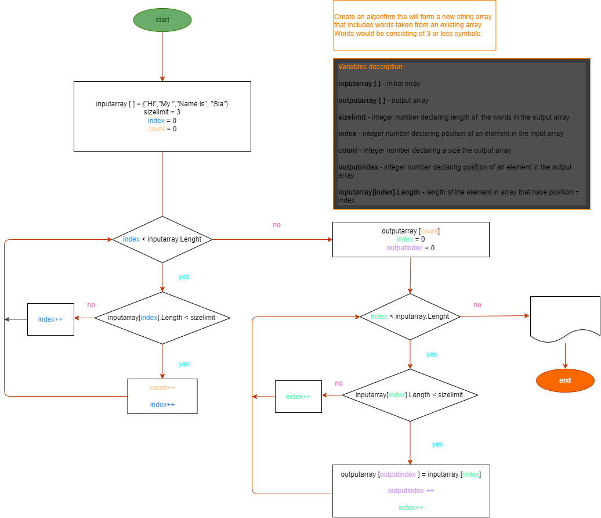

# Итоговая проверочная работа

> Данная работа необходима для проверки ваших знаний и навыков по итогу прохождения первого блока обучения на программе раработчик. Мы должны убедиться, что базовое знакомство c it прошло успешно. 

## Задание:

1. Cоздать репозиторий на GitHub
2. Нарисовать блок-схему алгоритма
3. Снабдить репо текстовым описанием решения (README.md)
4. Написать программу, решающую поставленную задачу
5. Использовать контроль версий

## Задача:

Написать программу, которая из имеющегося массива строк формирует массив из строк, длинна которых <= 3 символам. Первоначальный массив можно задать с клавиатуры, либо задать на старте выполнения алгоритма. При решении не рекомендуется пользоваться коллекциями, лучше обойтись исключительно массивами.
 
 
*Пример:*

["Hi", "My name is", "Sia"] -> ["Hi","Sia"]
 
 
___
 

## Структура работы:

### 1. *Создание репозитория*:
Репозиторий создан для обеспечения контроля версий работы и возможности отката при возникновении ошибок. Разные этапы работы выполнялись в разных ветках репо, и были объединены в основную после проверки.
  

### 2. *Алгоритм решения задачи*:
Перед разработкой кода создана блок-схема, описывающая алгоритм выполнения основной части задачи (не включая создание массивов, их заполнение и вывод).

[Блок-схема](https://github.com/Kitsune17/Q1_Geek_Test/blob/main/Algorithm.drawio.png) создана с помощью расширения Draw.io Intergration:

  

### 3. *Код программы*:

[Код](Program.cs) написан на C#.

Программа принимает на вход заранее заданный массив, что приемлемо в соответствии с "[тех заданием](#задача)".

Вообще все переменные заданы в условии задачи, поэтому статично объявлены в теле программы :3